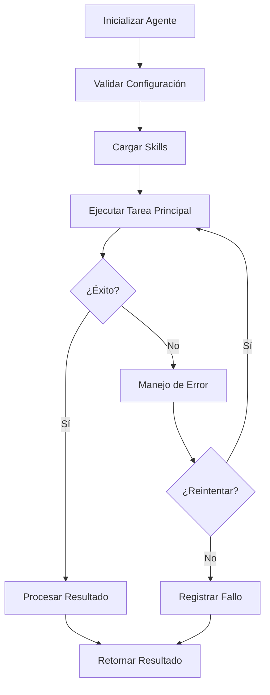

# Agent Template

## Metadata
```yaml
agent:
  name: <agent_name>_agent
  version: 1.0.0
  description: Breve descripción de lo que hace este agente
  category: automation | data_processing | reporting | integration
  
author:
  name: <Tu nombre>
  created: YYYY-MM-DD
  last_updated: YYYY-MM-DD

skills_required:
  - skill_name_1
  - skill_name_2
  - skill_name_3

configuration:
  max_retries: 3
  timeout: 300
  log_level: INFO
  # Otros parámetros específicos
```

---

## 1. Descripción

### Propósito
[Describe el propósito principal de este agente]

### Responsabilidades
- Responsabilidad 1
- Responsabilidad 2
- Responsabilidad 3

### Casos de Uso
1. **Caso de uso 1**: Descripción
2. **Caso de uso 2**: Descripción

---

## 2. Skills Requeridos

### Skill 1: <skill_name>
- **Ubicación**: `ai_global/skills/<skill_name>` o `<project>/skills/<skill_name>`
- **Versión mínima**: X.X.X
- **Uso**: Descripción de cómo el agente usa este skill

### Skill 2: <skill_name>
- **Ubicación**: `ai_global/skills/<skill_name>` o `<project>/skills/<skill_name>`
- **Versión mínima**: X.X.X
- **Uso**: Descripción de cómo el agente usa este skill

---

## 3. Configuración

### Parámetros de Entrada
```python
{
    "param1": "value1",  # Descripción de param1
    "param2": "value2",  # Descripción de param2
    "param3": 123,       # Descripción de param3 (numérico)
}
```

### Variables de Entorno
```bash
# Archivo .env requerido
AGENT_VAR_1=value
AGENT_VAR_2=value
```

### Archivos de Configuración
- `agent.yaml`: Configuración principal
- `config/<env>.yaml`: Configuración por ambiente (dev, prod)

---

## 4. Uso

### Instalación
```bash
# Si tiene dependencias específicas
pip install -r requirements.txt
```

### Ejemplo Básico
```python
from <path>.agent_core import <AgentName>Agent

# Inicializar agente
agent = <AgentName>Agent(config={
    "param1": "value1",
    "param2": "value2"
})

# Ejecutar agente
result = agent.execute()

# Ver resultado
print(result)
```

### Ejemplo Avanzado
```python
# Configuración avanzada
config = {
    "param1": "value1",
    "max_retries": 5,
    "timeout": 600,
    "skills_config": {
        "skill_1": {"custom_param": "value"}
    }
}

agent = <AgentName>Agent(config=config)

# Ejecutar con callbacks
result = agent.execute(
    on_success=lambda r: print(f"Success: {r}"),
    on_error=lambda e: print(f"Error: {e}")
)
```

---

## 5. Estructura de Archivos

```
<agent_name>/
├── README.md              # Este archivo
├── agent.yaml             # Configuración del agente
├── __init__.py
├── agent_core.py          # Lógica principal del agente
├── utils.py               # Utilidades (opcional)
├── config/
│   ├── dev.yaml
│   └── prod.yaml
├── tests/
│   ├── test_agent_core.py
│   └── test_integration.py
└── requirements.txt       # Dependencias específicas (si las hay)
```

---

## 6. Flujo de Ejecución



---

## 7. Logs y Monitoreo

### Ubicación de Logs
```
logs/<agent_name>/
├── agent_YYYYMMDD.log
└── errors_YYYYMMDD.log
```

### Eventos Registrados
- ✅ Inicialización del agente
- ✅ Carga de skills
- ✅ Inicio de ejecución
- ✅ Resultados parciales
- ✅ Errores y excepciones
- ✅ Resultado final

---

## 8. Testing

### Unit Tests
```bash
pytest tests/test_agent_core.py -v
```

### Integration Tests
```bash
pytest tests/test_integration.py -v
```

### Coverage
```bash
pytest --cov=<agent_name> tests/
```

---

## 9. Troubleshooting

### Error Común 1
**Síntoma**: Descripción del error  
**Causa**: Por qué ocurre  
**Solución**: Cómo resolverlo

### Error Común 2
**Síntoma**: Descripción del error  
**Causa**: Por qué ocurre  
**Solución**: Cómo resolverlo

---

## 10. Changelog

### v1.0.0 (YYYY-MM-DD)
- Versión inicial
- Implementación de funcionalidad básica

---

## 11. Referencias

- **Skills usados**: 
  - [Skill 1](../skills/skill_1/README.md)
  - [Skill 2](../skills/skill_2/README.md)
- **Knowledge relacionado**:
  - [Documento 1](../../knowledge/local/doc1.md)
- **Tickets**:
  - [TKT-XXX-001](../../tickets/TKT-XXX-001.md)

---

**Mantenedor**: <Nombre>  
**Última actualización**: YYYY-MM-DD
